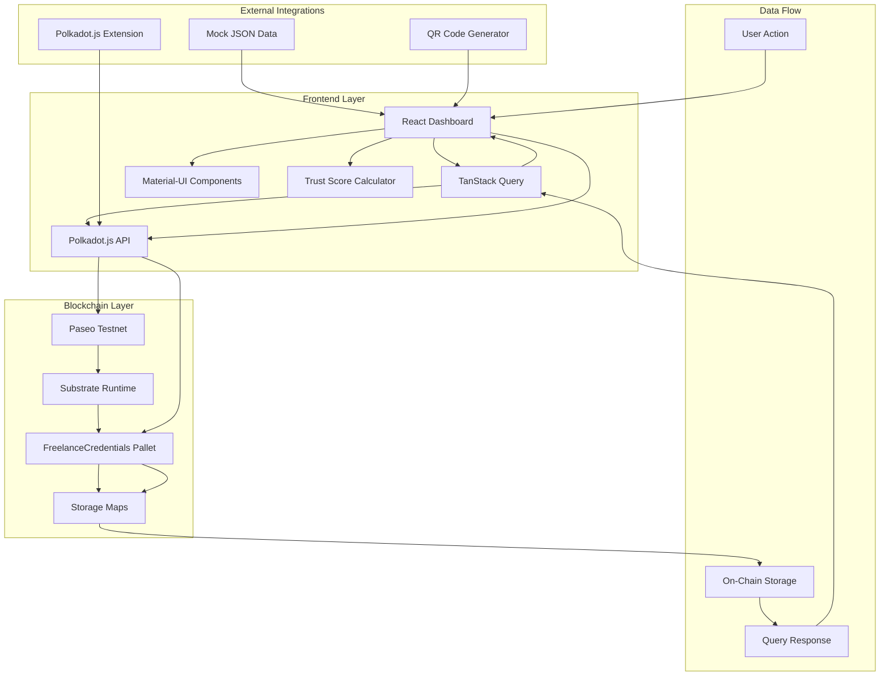
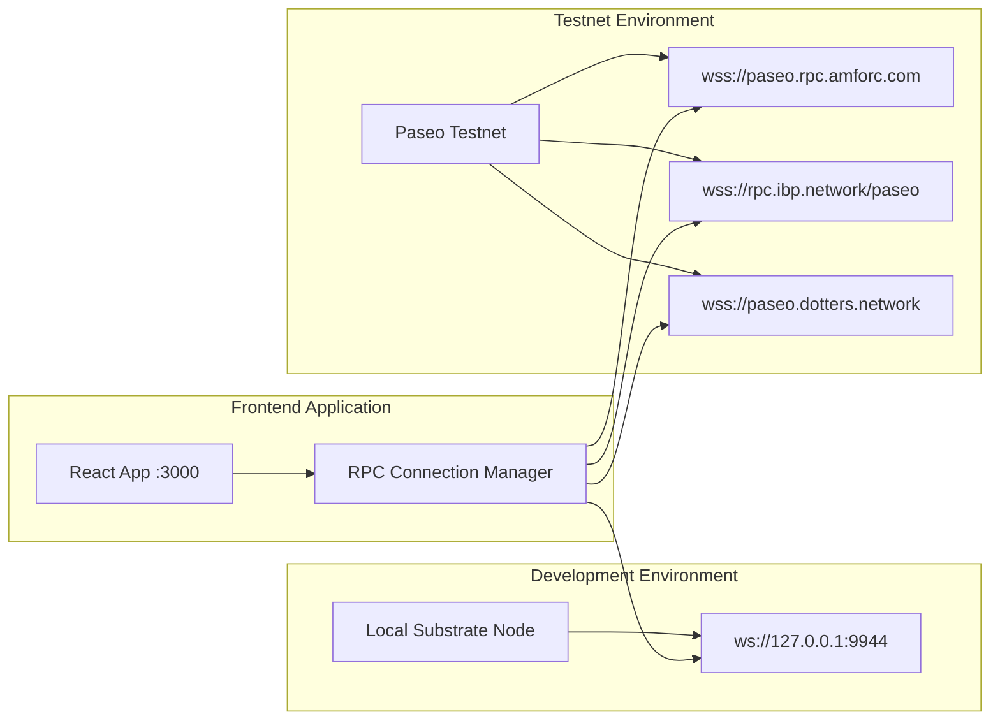
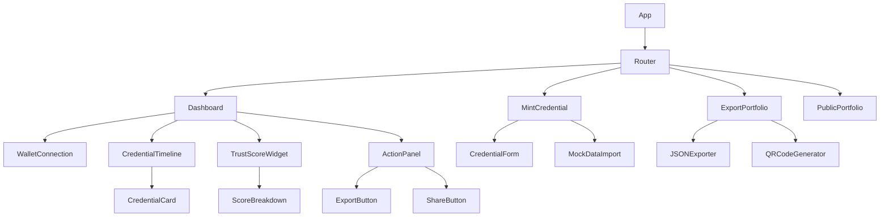

# FreelanceForge Design Document

## Overview

FreelanceForge is architected as a decentralized application leveraging Polkadot's Substrate framework for custom blockchain logic and React.js for the user interface. The system implements a dual-layer architecture where credential data is stored immutably on-chain as NFT metadata, while the frontend provides an intuitive dashboard for portfolio management and sharing.

The design prioritizes user sovereignty, cross-chain interoperability, and cost efficiency while maintaining the simplicity required for a 7-day development sprint. The architecture separates concerns between blockchain operations (Substrate pallet), state management (TanStack Query), and user interface (React components), enabling parallel development and testing.

## Architecture

### System Architecture Diagram



### Technology Stack

| Component              | Technology               | Version | Purpose                                         |
| ---------------------- | ------------------------ | ------- | ----------------------------------------------- |
| **Backend Runtime**    | Substrate (Rust)         | 3.0+    | Custom blockchain logic for NFT minting/storage |
| **Frontend Framework** | React.js                 | 18.2.0  | User interface and dashboard                    |
| **State Management**   | TanStack Query           | 5.51.x  | Server state and async data management          |
| **Blockchain API**     | @polkadot/api            | 11.3.1  | Connect frontend to Substrate node              |
| **Wallet Integration** | @polkadot/extension-dapp | 0.47.x  | Wallet connection and transaction signing       |
| **UI Components**      | @mui/material            | 5.16.x  | Pre-built responsive components                 |
| **Data Export**        | Native JSON.stringify    | N/A     | Generate JSON resumes                           |
| **QR Generation**      | qrcode.react             | 3.1.x   | Generate shareable QR codes                     |

### Network Architecture



## Components and Interfaces

### Substrate Pallet Design

#### Storage Schema

```rust
// Storage: credential_id -> (owner, JSON metadata)
#[pallet::storage]
pub type Credentials<T: Config> = StorageMap<
    _,
    Blake2_128Concat,
    T::Hash,
    (T::AccountId, BoundedVec<u8, ConstU32<4096>>),
    OptionQuery,
>;

// Storage: owner -> list of credential IDs
#[pallet::storage]
pub type OwnerCredentials<T: Config> = StorageMap<
    _,
    Blake2_128Concat,
    T::AccountId,
    BoundedVec<T::Hash, ConstU32<500>>,
    ValueQuery,
>;
```

#### Extrinsic Interface

```rust
#[pallet::call]
impl<T: Config> Pallet<T> {
    /// Mint a new credential NFT
    ///
    /// Parameters:
    /// - metadata_json: JSON string containing credential data (max 4KB)
    ///
    /// Returns:
    /// - DispatchResult indicating success/failure
    ///
    /// Emits:
    /// - CredentialMinted event with credential_id and owner
    #[pallet::weight(T::DbWeight::get().reads_writes(2, 2) + 50_000)]
    pub fn mint_credential(
        origin: OriginFor<T>,
        metadata_json: Vec<u8>,
    ) -> DispatchResult;
}
```

#### Error Handling

```rust
#[pallet::error]
pub enum Error<T> {
    /// Credential with this metadata hash already exists
    CredentialAlreadyExists,
    /// Metadata exceeds 4KB limit
    MetadataTooLarge,
    /// User has reached maximum of 500 credentials
    TooManyCredentials,
}
```

### Frontend Component Architecture

#### Component Hierarchy



#### Core Component Interfaces

```typescript
// Credential data structure
interface Credential {
  id: string;
  owner: string;
  credential_type: "skill" | "review" | "payment" | "certification";
  name: string;
  description: string;
  issuer: string;
  rating?: number;
  timestamp: string;
  visibility: "public" | "private";
  proof_hash?: string;
}

// Trust score breakdown
interface TrustScore {
  total: number;
  tier: "Bronze" | "Silver" | "Gold" | "Platinum";
  breakdown: {
    review_score: number;
    skill_score: number;
    payment_score: number;
  };
}

// Component props interfaces
interface DashboardProps {
  walletAddress: string | null;
}

interface CredentialTimelineProps {
  credentials: Credential[];
  loading: boolean;
  onSort: (field: string) => void;
  onFilter: (type: string) => void;
}

interface TrustScoreWidgetProps {
  score: TrustScore;
  animated?: boolean;
}
```

### API Integration Layer

#### Polkadot.js API Wrapper

```typescript
class FreelanceForgeAPI {
  private api: ApiPromise;
  private endpoints: string[];

  constructor() {
    this.endpoints = [
      "wss://paseo.dotters.network",
      "wss://rpc.ibp.network/paseo",
      "wss://paseo.rpc.amforc.com",
      "ws://127.0.0.1:9944",
    ];
  }

  async connect(): Promise<ApiPromise>;
  async mintCredential(
    accountAddress: string,
    credentialData: Credential
  ): Promise<string>;
  async getCredentials(accountAddress: string): Promise<Credential[]>;
  async getCredentialById(credentialId: string): Promise<Credential | null>;
}
```

#### TanStack Query Hooks

```typescript
// Custom hooks for data fetching
export function useCredentials(accountAddress: string | null) {
  return useQuery({
    queryKey: ["credentials", accountAddress],
    queryFn: () => getCredentials(accountAddress!),
    enabled: !!accountAddress,
    staleTime: 60000, // 60 seconds
    refetchInterval: false,
  });
}

export function useMintCredential() {
  const queryClient = useQueryClient();

  return useMutation({
    mutationFn: ({ accountAddress, credentialData }: MintParams) =>
      mintCredential(accountAddress, credentialData),
    onSuccess: (_, variables) => {
      queryClient.invalidateQueries({
        queryKey: ["credentials", variables.accountAddress],
      });
    },
  });
}

export function useTrustScore(credentials: Credential[]) {
  return useMemo(() => calculateTrustScore(credentials), [credentials]);
}
```

## Data Models

### Credential Metadata Schema

```json
{
  "$schema": "http://json-schema.org/draft-07/schema#",
  "type": "object",
  "title": "FreelanceForge Credential Schema",
  "required": ["credential_type", "name", "issuer", "timestamp"],
  "properties": {
    "credential_type": {
      "type": "string",
      "enum": ["skill", "review", "payment", "certification"],
      "description": "Type of credential being minted"
    },
    "name": {
      "type": "string",
      "maxLength": 100,
      "description": "Display name of the credential"
    },
    "description": {
      "type": "string",
      "maxLength": 500,
      "description": "Detailed description of the credential"
    },
    "issuer": {
      "type": "string",
      "maxLength": 100,
      "description": "Entity that issued/verified this credential"
    },
    "rating": {
      "type": "number",
      "minimum": 0,
      "maximum": 5,
      "description": "Rating score (for reviews)"
    },
    "timestamp": {
      "type": "string",
      "format": "date-time",
      "description": "ISO 8601 timestamp of credential creation"
    },
    "visibility": {
      "type": "string",
      "enum": ["public", "private"],
      "default": "public",
      "description": "Visibility setting for portfolio sharing"
    },
    "proof_hash": {
      "type": "string",
      "pattern": "^[a-fA-F0-9]{64}$",
      "description": "SHA256 hash of supporting document (optional)"
    },
    "metadata": {
      "type": "object",
      "description": "Additional platform-specific data",
      "properties": {
        "platform": { "type": "string" },
        "external_id": { "type": "string" },
        "verification_url": { "type": "string" }
      }
    }
  }
}
```

### Trust Score Calculation Model

```typescript
interface TrustScoreCalculation {
  // Input data
  credentials: Credential[];

  // Intermediate calculations
  reviewMetrics: {
    averageRating: number;
    totalReviews: number;
    reviewScore: number; // (averageRating / 5) * 100 * 0.6
  };

  skillMetrics: {
    totalSkills: number;
    certifications: number;
    skillScore: number; // (skills * 5) + (certs * 10), max 100, * 0.3
  };

  paymentMetrics: {
    totalVolume: number;
    recentVolume: number;
    recencyFactor: number; // 1.0, 0.7, or 0.5 based on age
    paymentScore: number; // MIN(100, (volume / 1000) * 10) * recency * 0.1
  };

  // Final output
  totalScore: number; // Sum of all component scores
  tier: "Bronze" | "Silver" | "Gold" | "Platinum";
}
```

### Export Data Models

```typescript
// JSON export format
interface PortfolioExport {
  wallet_address: string;
  export_timestamp: string;
  trust_score: TrustScore;
  credentials: Credential[];
  blockchain_verification: {
    network: "Paseo" | "Local";
    explorer_url: string;
    total_credentials: number;
  };
  metadata: {
    app_version: string;
    export_format_version: string;
  };
}

// Public sharing format
interface PublicPortfolio {
  wallet_address: string;
  display_name?: string;
  trust_score: TrustScore;
  public_credentials: Credential[]; // Only visibility: 'public'
  last_updated: string;
  verification_link: string;
}
```

## Error Handling

### Error Classification System

```typescript
enum ErrorType {
  // Wallet-related errors
  WALLET_NOT_DETECTED = "WALLET_NOT_DETECTED",
  WALLET_CONNECTION_FAILED = "WALLET_CONNECTION_FAILED",
  WALLET_ACCOUNT_NOT_FOUND = "WALLET_ACCOUNT_NOT_FOUND",

  // Transaction errors
  INSUFFICIENT_BALANCE = "INSUFFICIENT_BALANCE",
  TRANSACTION_REJECTED = "TRANSACTION_REJECTED",
  TRANSACTION_FAILED = "TRANSACTION_FAILED",

  // Pallet-specific errors
  CREDENTIAL_ALREADY_EXISTS = "CREDENTIAL_ALREADY_EXISTS",
  METADATA_TOO_LARGE = "METADATA_TOO_LARGE",
  TOO_MANY_CREDENTIALS = "TOO_MANY_CREDENTIALS",

  // Network errors
  NETWORK_CONNECTION_FAILED = "NETWORK_CONNECTION_FAILED",
  RPC_TIMEOUT = "RPC_TIMEOUT",

  // Validation errors
  INVALID_CREDENTIAL_DATA = "INVALID_CREDENTIAL_DATA",
  FILE_TOO_LARGE = "FILE_TOO_LARGE",
  INVALID_JSON_FORMAT = "INVALID_JSON_FORMAT",
}

interface ErrorHandler {
  type: ErrorType;
  userMessage: string;
  technicalMessage: string;
  suggestedAction: string;
  retryable: boolean;
}
```

### Error Recovery Strategies

```typescript
class ErrorRecoveryManager {
  // Automatic retry with exponential backoff
  async retryWithBackoff<T>(
    operation: () => Promise<T>,
    maxRetries: number = 3,
    baseDelay: number = 1000
  ): Promise<T>;

  // Fallback RPC endpoint switching
  async switchToFallbackEndpoint(): Promise<void>;

  // Transaction retry with higher gas
  async retryTransactionWithHigherFee(
    transaction: any,
    feeMultiplier: number = 1.5
  ): Promise<string>;

  // Graceful degradation for offline mode
  enableOfflineMode(): void;
}
```

## Testing Strategy

### Unit Testing Architecture

```typescript
// Substrate pallet tests (Rust)
mod tests {
    use super::*;
    use frame_support::{assert_ok, assert_noop};

    #[test]
    fn test_mint_credential_success() {
        // Test successful credential minting
    }

    #[test]
    fn test_mint_credential_duplicate_fails() {
        // Test duplicate prevention
    }

    #[test]
    fn test_mint_credential_metadata_too_large() {
        // Test size validation
    }

    #[test]
    fn test_mint_500th_credential() {
        // Test boundary conditions
    }
}

// Frontend component tests (Jest + React Testing Library)
describe('CredentialTimeline', () => {
  test('renders credentials in chronological order', () => {
    // Test timeline rendering
  });

  test('filters credentials by type', () => {
    // Test filtering functionality
  });

  test('handles loading states correctly', () => {
    // Test loading UI
  });
});

// Integration tests
describe('End-to-End Flows', () => {
  test('complete mint-to-dashboard flow', async () => {
    // Test full user journey
  });

  test('export and share functionality', async () => {
    // Test export/share features
  });
});
```

### Performance Testing Specifications

```typescript
interface PerformanceMetrics {
  // Page load performance
  initialRender: {
    target: 2000; // milliseconds
    measurement: "Time to Interactive (TTI)";
  };

  // Query performance
  credentialQuery: {
    target: 1000; // milliseconds
    measurement: "API response time";
  };

  // Transaction performance
  mintTransaction: {
    target: 3000; // milliseconds
    measurement: "Block confirmation time";
  };

  // UI responsiveness
  dashboardScroll: {
    target: 60; // FPS
    measurement: "Scroll performance with 100 credentials";
  };
}
```

## Security Considerations

### Authentication and Authorization

```typescript
interface SecurityModel {
  // Wallet-based authentication
  authentication: {
    method: "wallet-signature";
    privateKeyHandling: "never-stored";
    sessionManagement: "client-side-only";
  };

  // Transaction security
  transactionSecurity: {
    signatureRequired: true;
    transactionPreview: true;
    gasEstimation: true;
    replayProtection: "nonce-based";
  };

  // Data protection
  dataProtection: {
    onChainData: "public-metadata-only";
    privateKeyStorage: "never";
    sensitiveDataHandling: "client-side-encryption";
  };
}
```

### Input Validation and Sanitization

```typescript
class SecurityValidator {
  // Validate credential metadata
  validateCredentialData(data: any): ValidationResult {
    // JSON schema validation
    // XSS prevention
    // Size limits
    // Type checking
  }

  // Sanitize user inputs
  sanitizeInput(input: string): string {
    // HTML entity encoding
    // Script tag removal
    // SQL injection prevention
  }

  // Validate file uploads
  validateFileUpload(file: File): ValidationResult {
    // File type checking
    // Size limits
    // Content validation
  }
}
```

## Deployment Architecture

### Development Environment

```yaml
# docker-compose.yml for local development
version: "3.8"
services:
  substrate-node:
    build: ./substrate-node
    ports:
      - "9944:9944"
      - "9933:9933"
    command: ["--dev", "--ws-external", "--rpc-cors", "all"]

  frontend:
    build: ./frontend
    ports:
      - "3000:3000"
    environment:
      - REACT_APP_WS_PROVIDER=ws://localhost:9944
    depends_on:
      - substrate-node
```

### Production Deployment (Paseo Testnet)

```typescript
// Deployment configuration
interface DeploymentConfig {
  network: {
    name: "Paseo Testnet";
    endpoints: [
      "wss://paseo.dotters.network",
      "wss://rpc.ibp.network/paseo",
      "wss://paseo.rpc.amforc.com"
    ];
    explorer: "https://paseo.subscan.io";
  };

  frontend: {
    hosting: "Vercel" | "Netlify" | "GitHub Pages";
    domain: "freelanceforge.vercel.app";
    buildCommand: "npm run build";
    environmentVariables: {
      REACT_APP_NETWORK: "paseo";
      REACT_APP_WS_PROVIDER: "wss://paseo.dotters.network";
    };
  };

  monitoring: {
    errorTracking: "Sentry" | "LogRocket";
    analytics: "Google Analytics";
    uptime: "UptimeRobot";
  };
}
```

This design provides a comprehensive technical foundation for implementing FreelanceForge within the 7-day sprint timeline while maintaining scalability for future enhancements.
